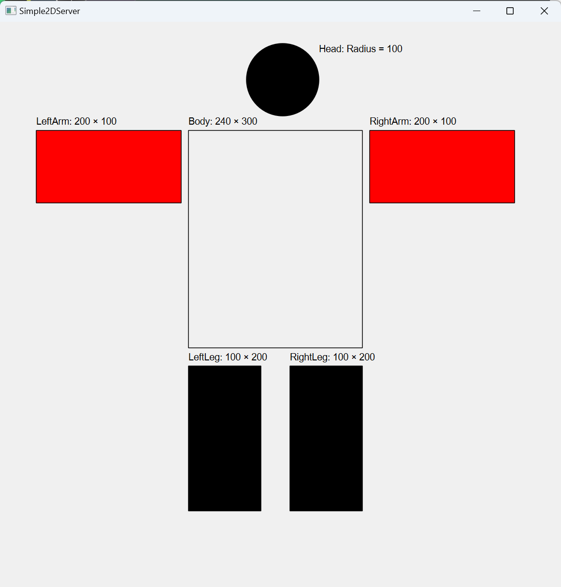
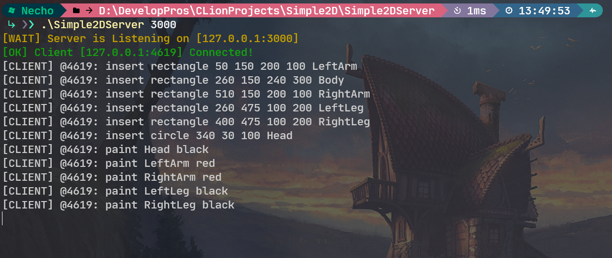
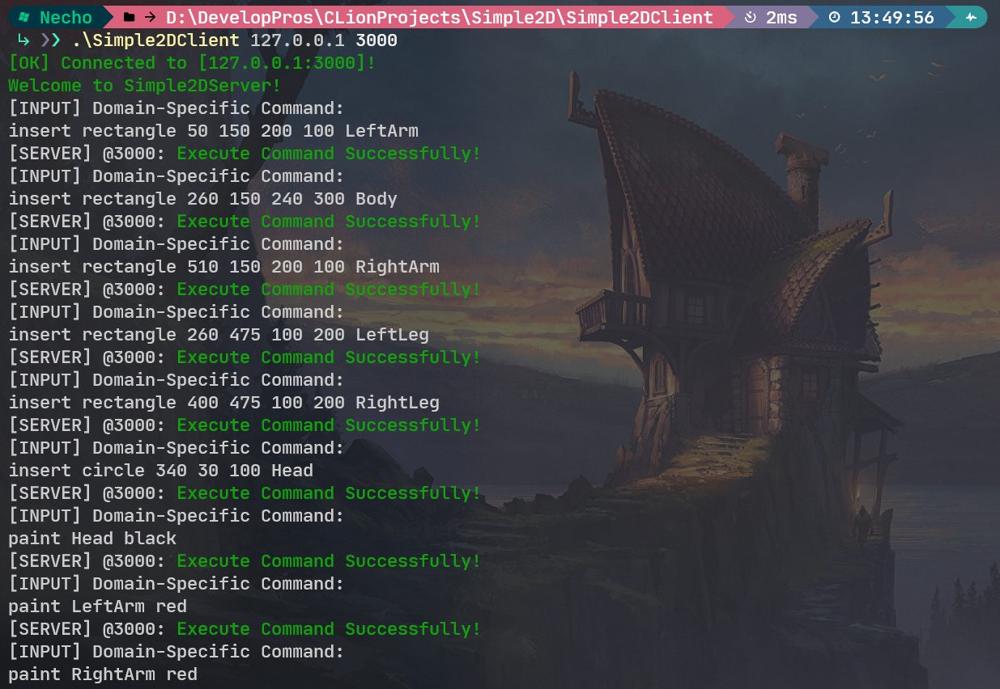

# Simple2DServer

## 需求梳理：

### 服务端(Server)：

1. 监听3000端口，用于接收来自客户端的指令并响应
2. 提供图形化窗口，根据客户端的命令绘制和显示2D图形

### 客户端(Client)：

1. 通过3000端口连接服务器
2. 向服务端发送指令，同时接收来自服务端的响应并输出

- 指令集

  - 符号变量

  | 符号   | 类型   | 说明                       | 示例               |
  | ------ | ------ | -------------------------- | ------------------ |
  | x      | double | 横坐标                     | 100                |
  | y      | double | 纵坐标                     | 100                |
  | radius | double | 圆形直径                   | 20                 |
  | length | double | 矩形长度                   | 200                |
  | width  | double | 矩形宽度                   | 100                |
  | name   | string | 图形名称                   | "head"             |
  | color  | string | 图形填充色<br />(默认为空) | "red"<br />"black" |

  - 指令操作

  | 指令   | 说明 | 示例                                                         |
  | ------ | ---- | ------------------------------------------------------------ |
  | insert | 插入 | ` insert circle 100 100 20 head`<br />在(100,100)处绘制一个名称为"head"、半径为20的圆形，默认不填充颜色 |
  | move   | 移动 | ` move leftarm -100 0`<br />按照偏移量(-100,0)平移名称为"leftarm"的图形 |
  | paint  | 上色 | ` paint body red`<br />将名称为"body"的图形填充为红色        |


## 解决方案：

### 服务端(Server)：

1. 技术选型：
   
- 开发语言：C++11
- 开发环境：Windows11 + CMake + MinGW
- QT模块(版本：6.4.2)：
   - 通信：QTcpSever\QTcpSocket\QHostAddress
   - 绘图：QPainter\QPaintEvent
   - 窗体：QMainWindow
2. 文件结构：

```
Simple2DServer.
├─main.cpp		// 服务端入口
├─lib
│  ├─Server.h	// 服务端-头文件
│  ├─Server.cpp	// 服务端-源文件
│  ├─Server.ui
│  └─ui_Server.h
├─Release
│  └─Simple2DServer.exe	// 可执行文件
└─CMakeLists.txt
```

3. 运行(.\Release\Simple2DServer.exe\)

  ```bash
.\Simple2DServer 3000
  ```

### 客户端(Client)：

1. 技术选型：
   
- 开发语言：C++11
- 开发环境：Windows11 + CMake + MinGW
- QT模块(版本：6.4.2)：
  - 通信：QTcpSocket\QHostAddress
2. 文件结构：

  ```
Simple2DClient.
├─main.cpp		// 客户端入口
├─Release
│  └─Simple2DClient.exe	// 可执行文件
└─CMakeLists.txt
  ```

3. 运行(.\Release\Simple2DClient.exe)

  ```bash
.\Simple2DClient 127.0.0.1 3000
  ```

​     

## 效果展示：


**对应指令：**

```c++
insert rectangle 50 150 200 100 LeftArm
insert rectangle 260 150 240 300 Body
insert rectangle 510 150 200 100 RightArm
insert rectangle 260 475 100 200 LeftLeg
insert rectangle 400 475 100 200 RightLeg
insert circle 340 30 100 Head
```




**对应指令：**

```c++
paint Head black
paint LeftArm red
paint RightArm red
paint LeftLeg black
paint RightLeg black
```

### 服务端(Server)：




### 客户端(Client)：


